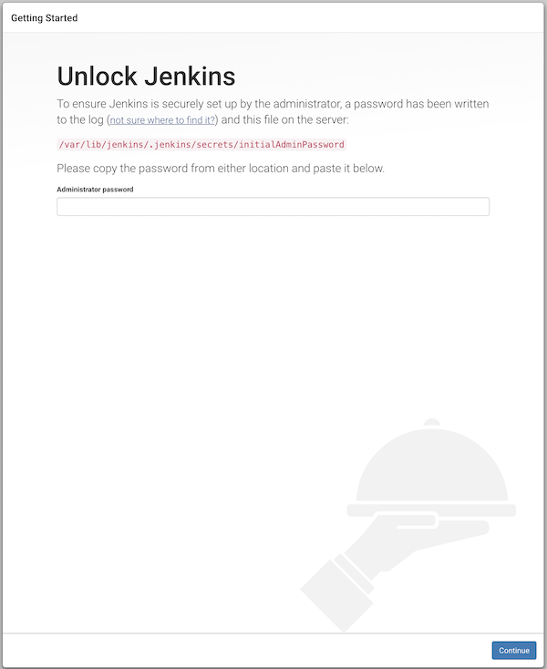

## 使用環境

```text
CentOS 7.6.1810
Apache 2.4.6
PHP 7.3.1
MySQL 5.7
phpMyAdmin 4.8
```

## ディレクトリ構造

```text
.
├── .editorconfig
├── .env
├── build
│   ├── db
│   │   ├── Dockerfile
│   │   └── my.cnf
│   └── web
│       ├── Dockerfile
│       ├── apache
│       │   ├── conf
│       │   │   ├── httpd.conf
│       │   │   └── magic
│       │   └── conf.d
│       │       ├── README
│       │       ├── autoindex.conf
│       │       ├── php.conf
│       │       ├── userdir.conf
│       │       └── welcome.conf
│       ├── jenkins.service
│       ├── php
│       │   └── php.ini
│       └── sql
├── data
│   ├── db
│   ├── jenkins
│   ├── pma
│   └── web
│       └── htdocs
├── docker-compose.yml
├── jenkins_db_export.sh
└── jenkins_db_import.sh
```

## 開発環境構築手順

### 最初に

この構築セットを使用する際は、Dockerのインストールが必要です。

また、Windows版ではVirtualBoxが使えなくなるため、両方使用する場合はVirtuarlBox内で環境構築を行うなどしてください。

### 使用しているポート番号

```text
webサーバー 80
DBサーバー 3306
phpmyadmin 8000
Jenkins 8080
```

既に使われている場合は、docker-compose.yml内のportsの左側を編集してください。

### 構築

すぐに構築を開始することができるが、DBやphpMyAdminのユーザー・パスワード設定を自分で行う場合は `lamp-study/.env` を編集すること。

1) ターミナルで、該当ディレクトリへ移動した上で `docker-compose up -d` を実行する
2) 処理が完了したら、 `docker-compose ps` を実行し、StatusがUpであることを確認する
3) `http://localhost` へアクセスできることを確認する

終了時は、必ず `docker-compose down` を実行すること。

down後に再び使うときは `docker-compose up -d` を実行することで立ち上げが可能。

Apacheのドキュメントルートは、 `/lamp-study/data/web/htdocs` である。

### ファイル説明

#### build/db/my.cnf

MySQLの設定ファイル。なんらかの設定を加えたい場合はこのファイルに追記してください。また、反映させる際はコンテナの再ビルドが必要です。

#### build/web/apache/httpd.conf

Apacheの設定ファイル。Apacheの設定を変更したい場合はこのファイルを編集してください。また、反映させる際はコンテナの再構築を行うか、webコンテナ内で `systemctl restart httpd` を実行する必要があります。

#### build/web/php/php.ini

PHPの設定ファイル。PHPの設定を変更する場合は、このファイルを編集してください。反映させる際は、コンテナの再ビルドが必要です。

#### build/web/sql

Jenkinsを利用して、このディレクトリに入れたSQLファイルをインポートすることや、エクスポートしたSQLファイルを保存する場所として使用します。

#### jenkins_db_export.sh・jenkins_db_import.sh

Jenkinsで使用するシェルです。

## Jenkinsについて

Jenkinsとは、ビルド・検証・デプロイを自動化するツールです。今回は、DBのインポートとエクスポートを自動で行なうために使います。

### 初期設定

初回実行時のみ、以下の画面が表示されます。



ここでのAdministrator passwordは、 `/lamp-study/data/jenkins/.jenkins/secrets/initialAdminPassword` から確認可能です。

正しいpasswordが入力された上でContinueを押下すると、以下の画面が表示されます。


ここでは、Install suggested pluginsを選択してください。

インストールが完了すると、以下の画面に遷移します。


Jenkinsへログインするユーザーの作成を行います。入力が完了したら、Save and Continueを押下します。


ここではJenkinsのURLを設定しますが、そのままSave and Finishで設定を終えてください。

また、hostsの設定をした上でアクセスしている場合はURLがその内容になっていることがありますので、適宜変更をしてください。

### ジョブの設定

Jenkinsで実行したい内容を登録することができます。ここでは、DBをエクスポートするシェルを登録します。


ジョブ名を入力し、フリースタイル・プロジェクトのビルドを選択後、OKを押下します。


ビルドの項目でビルド手順を追加を押下します。プルダウンの中にあるシェルの実行を選択するとシェルスクリプトを記述する項目が表示されます。

jenkins_db_export.shの中身をこの中に貼り付け、ビルド後の処理の追加からビルド終了後にワークスペースを削除するを選択し、保存してください。

ダッシュボードへ戻ると、先ほど保存したジョブが表示されています。


一番右のアイコンを押下することで先ほど登録したシェルが実行されます。

今回の場合、DBが存在すると自動でエクスポートが実行されて、 `/lamp-study/build/db/sql` にエクスポートされたDBが保存されます。

### パラメータを指定したビルドの実行


ビルドのパラメータ化にチェックを入れ、パラメータの追加から追加したい内容を設定することでシェルに対して動的なパラメータ設定が可能になります。

ここで設定されたパラメータの名前が変数となります。シェルスクリプトでこのパラメータを使用する際は `${パラメータの名前}` と記述します。
